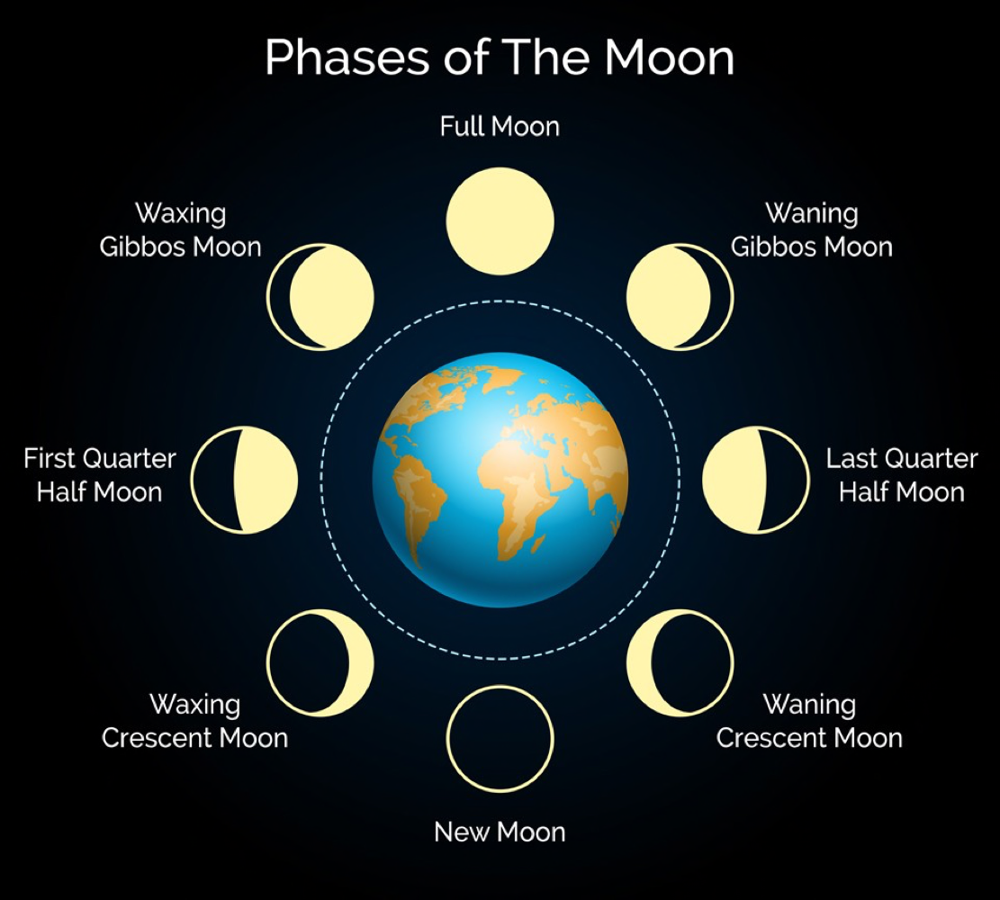

the lunar cycle is celebrated in four parts. [new moon](new%20moon.md), [first quarter moon](first%20quarter%20moon.md), [full moon](full%20moon.md), and [last quarter moon](last%20quarter%20moon.md). these celebrations, for the most part, do not follow the modern calendar.

- [2023 moons](2023%20moons.md)

# moon names

these are the names i've given each full moon in accordance with what's happening in my part of the world (north carolina, usa).

month|name
-|-
january|coyote moon
february|birdsong moon
march|daffodil moon
april|pollen moon
may|snake moon
june|strawberry moon
july|beach moon
august|heat moon
september|rose moon
october|
november|
december|

[creek moon names](https://www.wwu.edu/astro101/indianmoons.shtml)

# phases of the moon

# flowing with the moon

phase|flow
-|-
new moon|set intentions
waxing crescent moon|sit with & visualize intentions
first quarter moon|take action & build momentum
waxing gibbous moon|trust the work
full moon|gratitude, joy, & celebration
waning gibbous moon|be present & grateful
last quarter moon|let go & forgive
waning crescent moon|rest, recover, & reflect