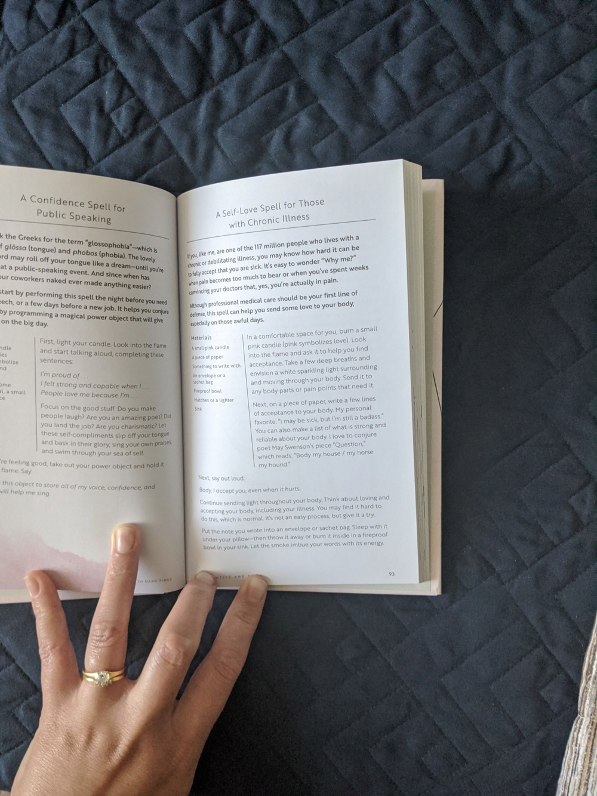

# materials

- small pink candle
- piece of paper
- writing utensil
- envelope or sachet bag
- fireproof bowl
- lighter

# instructions

in a comfortable place, burn a small pink candle to symbolize love. liik into the flame and ask it to help you find acceptance. take a few deep breaths and envision a white sparkling light surrounding and moving through your body. send it to any body parts or pain points that need it.

on a piece of paper, write a few lines of acceptance to your body. make a list of what is strong and reliable.

say out loud: body, i accept you, even when it hurts.

continue sending light through your body. think about loving and accepting your body, including your illness or injury.

put the not in the envelope/sachet bag. sleep with it under your pillow then throw it away or burn it. let the smoke imbue your words with its energy.

---

via *light magic for dark times* @herbal.tea#4869 on discord